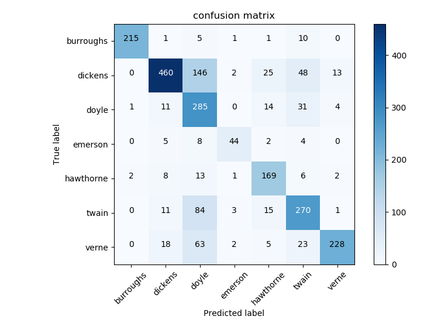

__| Andrew Berger | CS480 | HW5 | 3/6/2018 |__

# Bernoulli Naive Bayes Classification for Predicting the Authorship of Text

### Proposal

      This paper is a study in the classification of text by author using a naive bayesian bernoulli supervised learning model.
      The features of the model are the most frequent 1000 lemmatized words of all texts.
      The machine will consume arrays of 0s and 1s, each number representing whether or not the paragraph
      contains that feature. This program will enable the prediction of authorship, given the occurance
      of textual features.

### Data and Feature Selection

      The text consumed by the classifier are all non-fiction novels written between 1839 and 1884 from various American and English authors.
      The data read from each novel is at least greater than 324 KB and not more than 759 KB.
      Stopwords are omitted as features and words are lemmatized before becoming a feature. 
      Lemmatization is used to improve redundancy in the feature set and omit variants of stopwords.
      The number of features was optimized and chosen based on the best performance of a grid search, using values 100, 500, 1000, and 2500.

### Creation of Training Set

      The make_arff.py program reads 7 texts, each by different authors, generates a histogram of word counts, and writes the training data to a file.
      The most frequently occuring 1000 words are used to construct an arff file that can be read by the classify.py program.
      Each of the 1000 words are declared as an attribute in the arff file, with possible values either 0 or 1.
      The data is generated as such: for each paragraph in a text, iterate through the 1000 words and
      write a 1 if the word occurs in the paragraph, otherwise write a 0. The first element of each record in the arff file is the author.
      All paragraphs in the text are preprocessed to exclude stopwords and individual words are lemmatized 

### Execution

    -

### Evaluation

