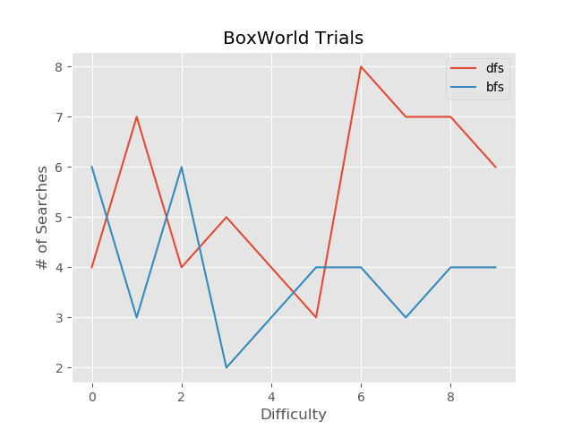
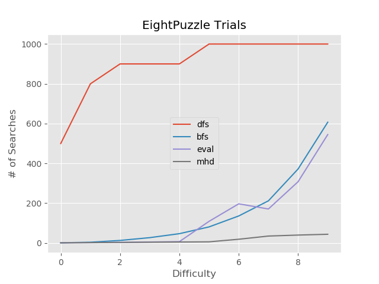
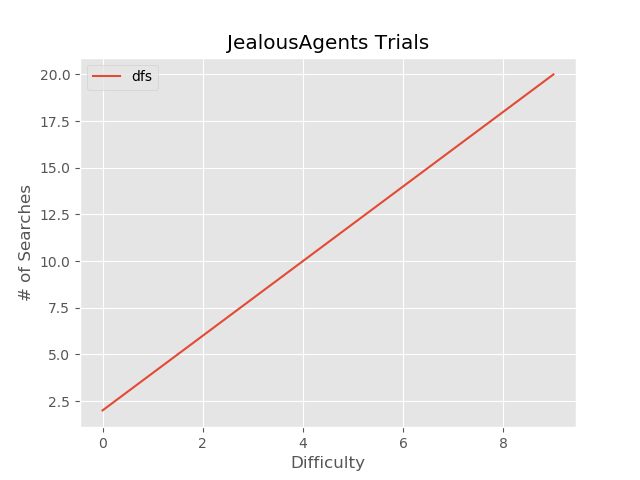

# AICompare
- an interface for visualizing and comparing A.I. game-playing search algorithms

***


## Example

```bash
python __main__.py
```

***

    ======== BoxWorld ========

    Implementation of the toy blocks world. 
    The world has 3 blocks (enumerate them however you’d like, but I would suggest ‘a’, ‘b’, and ‘c’).

    Devise a way to represent a state.
    (for example, [‘abc’] might represent the state where a is on top of b, which is on top of c). 

    Keep in mind that the relative position of a block or stack of
    blocks on the table (left or right) is irrelevant; therefore if you use a list then [‘ab’,
    ‘c’] and [‘c’, ‘ab’] would represent the same state of the world. 

    ,dfs,bfs
    1,4,6
    2,7,3
    3,4,6
    4,5,2
    5,4,3
    6,3,4
    7,8,4
    8,7,3
    9,7,4
    10,6,4

> 

    ======== EightPuzzle ========

    A simple “estimator” function for the 8-puzzle game is to count the number of
    tiles that are in the right place. (This estimator evaluates to an integer between 0 and 8). 
    
    Devise a better estimator function than this for 8-puzzle. “Manhattan
    distance” is a better estimator that was mentioned in class (although I haven’t
    shown you any data which supports that assertion). 
    
    You may choose a different estimator, but it must work better 
    than simply counting the number of tiles that are in the right place.
    
        ,dfs,bfs,eval,mhd
        1,500,1,1,1
        2,800,4,2,2
        3,900,13,3,3
        4,900,27,5,4
        5,900,47,7,5
        6,1000,81,109,6
        7,1000,136,197,19
        8,1000,212,171,35
        9,1000,372,308,40
        10,1000,607,545,44

> 

    ======== JealousAgents ========

    Three actors and their three agents want to cross a river in a boat that is capable
    of holding only two people at a time. Each agent is very aggressive and when
    given the chance would convince an actor to sign a new contract with the new
    agent (“poaching”). Since each agent is worried their rival agents will poach their
    client, we add the constraint that no actor and a different agent can be present by
    themselves on one of the banks, as this is the situation in which poaching occurs.
    
        ,dfs
        1,2
        2,4
        3,6
        4,8
        5,10
        6,12
        7,14
        8,16
        9,18
        10,20

         ==== randomly generated solution for JealousAgents with 6 players ====

        (0) Agnt(1)|Agnt(3)|Agnt(2)|Actr(3)|Actr(2)|Actr(1) ~~|_|boat|_|~~ 
        (1) Agnt(1)|Agnt(3)|Agnt(2)|Actr(3)|Actr(2) ~~|_|boat|_|~~ Actr(1)
        (2) Agnt(1)|Agnt(3)|Agnt(2)|Actr(2) ~~|_|boat|_|~~ Actr(3)|Actr(1)
        (3) Agnt(3)|Agnt(2)|Actr(2) ~~|_|boat|_|~~ Agnt(1)|Actr(3)|Actr(1)
        (4) Agnt(3)|Agnt(2) ~~|_|boat|_|~~ Actr(2)|Agnt(1)|Actr(3)|Actr(1)
        (5) Agnt(2) ~~|_|boat|_|~~ Agnt(3)|Actr(2)|Agnt(1)|Actr(3)|Actr(1)
        (6)  ~~|_|boat|_|~~ Agnt(2)|Agnt(3)|Actr(2)|Agnt(1)|Actr(3)|Actr(1)

> 

